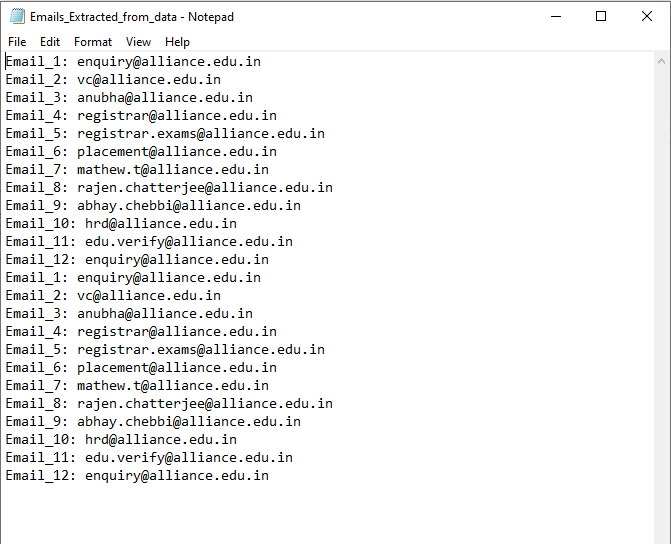

# Email Extractor 

Extract all emails from a document/text and store it in a txt file. This is helpful for the people trying to copy lots of emails from a file which has other info(not just emails). Instead of copying each email, this python file extracts all emails from the document/text and stores in a .txt file. Just copy everything from a document and run the Python file!

## How to play
Email Extracter Helps you to extract email ids from any text file

To perform the task make a `data.txt` file and paste your data there and 
run below code with Python 3 installed.

python emailextract.py 

or

python3 emailextract.py "C:\Users\PycharmProjects\EmailExtracter\data.txt"

The program will extract all the emails from the file and automatically create a new file called `Email_Extracted_from_data.txt` with only emails in it



Also tells you how many email ids it have extracted from that file
`
12 emails found !!!
`
Output file will be written to the same path as that of Input.
you can add new data and extracted email ids will keep adding in the file.

### Module used
python modules
```
import re
```

## PRE-REQUISITES
Your laptop with 3.7.x (onwards) installed.

**NOTE:** Those with Linux and MacOSX would have Python installed by default, no action required.

Windows: Download the version for your laptop via https://www.python.org/downloads/

**NOTES**
In your preferred editor, make sure indentation is set to "4 spaces".

---

## Run using Python3.8+
1. Clone or download repositiory: https://github.com/arevish/email-extractor.git
2. In source folder, run `python3 'emailextract.py'` to start program, optionally, run with `--help` argument to see other runtime options.

### ThankYou!